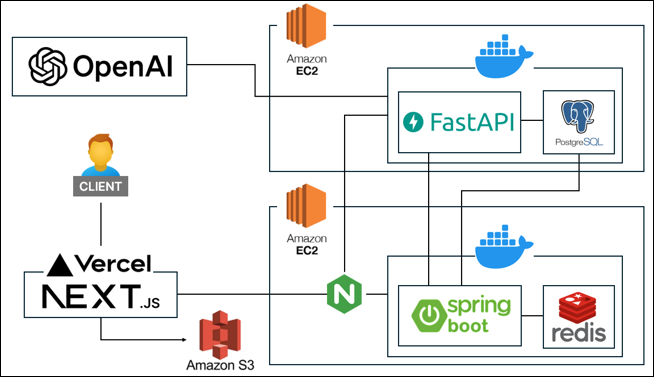

# 🫧 Bubblog - Personalized Blog AI Chatbot
**"글이 대화가 되는 블로그"**

**Bubblog**은 사용자의 블로그 콘텐츠를 기반으로 **개인화된 AI 챗봇**을 생성하여, 
대화를 통해 블로그 내용을 탐색할 수 있는 상호작용형 블로그 플랫폼

---

## 📌 프로젝트 개요

- **주제**: 개인 블로그 기반 AI 챗봇 시스템  
- **목표**: 블로그 글을 임베딩하고, RAG(Retrieval-Augmented Generation) 기반 AI 챗봇을 통해 방문자와 자연스러운 대화를 제공  
- **주요 기능**:
  - 카테고리·태그 기반 콘텐츠 필터링
  - SSE 기반 실시간 스트리밍 응답
  - 사용자별 챗봇 성능 비교 및 성장 분석

---

## 👥 팀 소개

|    [**이승찬**](https://github.com/chan000518) |    [**문덕영**](https://github.com/mdy3722) |    [**박의찬**](https://github.com/ekdnlt714714) |
|------------------|------------------|------------------|
| 팀장 / 백엔드·프론트·AI 서버 | 팀원 / 백엔드 | 팀원 / AI 서버 |
| - 아키텍처 설계   - Spring Boot API 개발   - CI/CD   - Next.js 기반 UI 개발   - AI 서버 개발 및 배포   - 벡터 DB 구축 | - 아키텍처 설계   - ERD 설계   - Spring Boot API 개발 및 배포   - CI/CD   - Redis 구성   - AWS S3 연동 | - 챗봇 서버 개발   - 프롬프트 엔지니어링 |

## 🧱 시스템 구조

* **인증 및 블로그 관리**: Spring Boot
* **챗봇 응답 및 유사도 검색**: FastAPI + RAG 구조
* **벡터 저장 및 검색**: PostgreSQL + pgvector

---

## 🛠 기술 스택

| 영역      | 사용 기술                                  |
| ------- | -------------------------------------- |
| 프론트엔드   | Next.js, TypeScript, Tailwind CSS      |
| 백엔드     | Spring Boot, JPA, PostgreSQL, Redis    |
| AI 서버   | FastAPI, OpenAI API, pgvector          |
| 인증      | JWT                                    |
| 배포 및 운영 | Docker, Nginx, AWS EC2, GitHub Actions |

---

## 📂 레포지토리 주소

| 영역    | 링크                                                                    |
| ----- | --------------------------------------------------------------------- |
| 프론트엔드 | 🔗 [bubblog-frontend](https://github.com/bubblog/bubblog-FE)   |
| 백엔드   | 🔗 [bubblog-backend](https://github.com/bubblog/bubblog-BE)     |
| AI 서버 | 🔗 [bubblog-ai-server](https://github.com/bubblog/bubblog-AI) |

---

## 위키 주소
🔗 [위키](https://github.com/bubblog/.github/wiki)

